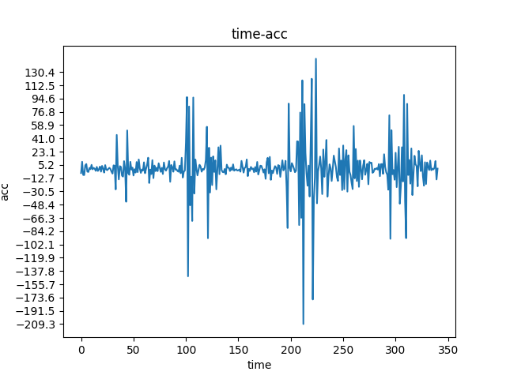

# 简易跌倒检测

## ✨程序的基本逻辑

首先使用mediapipe检测出每个骨骼特征点的具体坐标，然后求其所有y的平均值，与之前的y作差得到速度，再进一步求知加速度。

在我的测试中，我向下做了三次跌倒的动作，绘制出的图是这样的。



可以明显看出有三个高峰，所以可以使用`观察法`设定一个阈值，当加速度超过这个阈值的时候，就认为跌倒了，即可发出报警，这就是本程序的基本原理。

## 🤔可以改进的地方

结合速度和加速度，用一个简单的一阶公式计算出置信得分，当置信得分高于阈值，即可认为跌倒了。

例如$跌倒置信分数 = 0.5 * 速度 + 0.5 * 加速度$

*注意这个权重是随便写的，不知道效果好不好*

可进一步结合机器学习的算法，LSTM等，将速度或加速度的序列输入，预测得到结果。

## 🚀如何运行

```shell
# 虚拟环境
python -m venv .venv
.venv/Scripts/Activate.ps1 # Windows Powershell
pip install -r requirements.txt
```